# AI-Based Semiconductor Wafer Defect Pattern Detection

**A Deep Learning Approach for Automated Wafer-Map Classification**

ML Project Report · Generated 2026-10-08 from the project's result files

**Team:** Balasudhan (RA2411003012164), Kadhir Anand (RA2411003012146), Sarvesh (RA2411003012165), Reenu T R (RA2411003012132)

**Repository:** https://github.com/BALASUDHAN1807/WaferSense-AI

> Every number in this report is read automatically from `results/reports/` by `src/make_report.py`.
> The dataset is **synthetic** (generated by `src/dataset.py`); results are not claims about real fab data.

---

## Abstract

Wafer-map defect patterns indicate which manufacturing step caused yield loss. This project builds an
end-to-end system that classifies a wafer map into one of nine patterns (Center, Donut, Edge-Loc,
Edge-Ring, Loc, Near-Full, Random, Scratch, None). A synthetic dataset of 900 wafer maps
was generated, validated, analysed and split 70/15/15. Three models — a custom CNN, ResNet50 and
EfficientNetB0 — were trained on identical data and evaluated on the same held-out test set. Ranked by
macro F1: CNN (0.9703), EfficientNetB0 (0.9481), ResNet50 (0.9334). The best model, **CNN**, was selected automatically and powers a
command-line prediction engine and a Gradio web application.

## 1. Introduction

Semiconductor wafers are tested die by die; plotting the failing dies gives a *wafer map*. The spatial
shape of the failures is a fingerprint of the root cause — a scratch points to wafer handling, an edge ring
to edge etch or temperature non-uniformity, a centre cluster to deposition or spin-coating problems.
Automating the recognition of these patterns speeds up yield analysis and makes it consistent.

## 2. Problem Statement

Manual and rule-based inspection of wafer maps is slow and inconsistent. We treat defect-pattern
recognition as a **supervised multi-class image-classification problem**: given a 64 × 64 wafer-map image,
predict one of eight defect patterns or the normal class *None*.

## 3. Objectives

1. Build a complete, reproducible pipeline: validation → EDA → preprocessing → training → evaluation.
2. Train and compare a custom CNN, ResNet50 and EfficientNetB0 under the **same** data split.
3. Report accuracy, macro precision/recall/F1, per-class metrics, confusion matrices, training time and
   inference time.
4. Select the best model automatically (highest macro F1).
5. Deliver a prediction engine and a web application that show the class, confidence and all
   class probabilities.

## 4. Background: wafer defect patterns

| Class | Description | Typical process cause |
|---|---|---|
| Center | Defect cluster at the wafer centre | Deposition / spin-coat non-uniformity |
| Donut | Ring-shaped band between centre and edge | Radial CMP or deposition non-uniformity |
| Edge-Loc | Localised cluster at the edge | Handling, clamping, edge-bead removal |
| Edge-Ring | Defects around the rim | Edge etch / temperature non-uniformity |
| Loc | Localised cluster inside the wafer | Local contamination |
| Near-Full | Almost the whole wafer fails | Major process excursion |
| Random | Scattered defects | Particles / contamination |
| Scratch | Thin line of defects | Mechanical scratch (robot, CMP debris) |
| None | No systematic pattern | Normal wafer |

## 5. Dataset Description

| Property | Value |
|---|---|
| Type | **Synthetic**, generated programmatically (`src/dataset.py`, seed 42) |
| Images | 900 PNG files |
| Classes | 9 (Center, Donut, Edge-Loc, Edge-Ring, Loc, Near-Full, Random, Scratch, None) |
| Per class | 100–100 (balanced: True) |
| Image size | 64 × 64 pixels, grayscale |
| Encoding | 0 = outside wafer, 127 = good die, 255 = defective die |

Each class is generated with randomised wafer radius, defect position, size, orientation and density
(e.g. partial donut rings, curved or double scratches) plus 0–3 % random background defects on every
wafer, so the classes are not trivially separable. The synthetic data is used because it gives a clean,
balanced, fully labelled benchmark; it does **not** reproduce all the variability of real fab data
(see Limitations).

## 6. Exploratory Data Analysis

Validation (`src/validate_dataset.py`) found no missing, unreadable or duplicate records and no invalid
labels. EDA (`src/eda.py`) results:

- 900 samples, 9 classes, perfectly balanced
  (Center: 100, Donut: 100, Edge-Loc: 100, Edge-Ring: 100, Loc: 100, Near-Full: 100, Random: 100, Scratch: 100, None: 100).
- Missing values in `labels.csv`: 0; duplicate records: 0.
- Pixel values: [0, 127, 255] (mean 93.298, std 81.498).
- Mean defective-die ratio per class:
  Center 0.067, Donut 0.154, Edge-Loc 0.029, Edge-Ring 0.162, Loc 0.030, Near-Full 0.841, Random 0.203, Scratch 0.036, None 0.014.
  Near-Full and Random are dense; Loc, Edge-Loc, Scratch and None are sparse, so the *location and shape*
  of defects — not just their amount — must be learned.

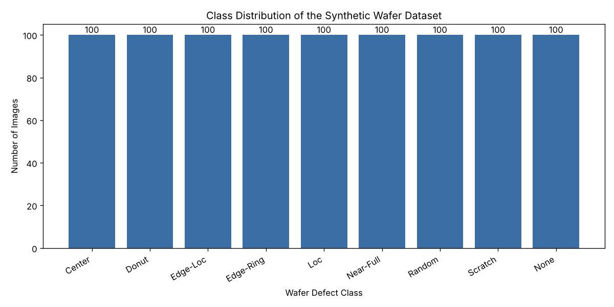

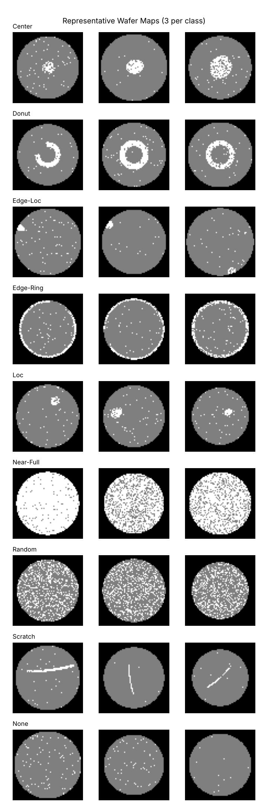

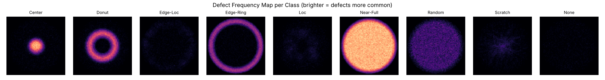

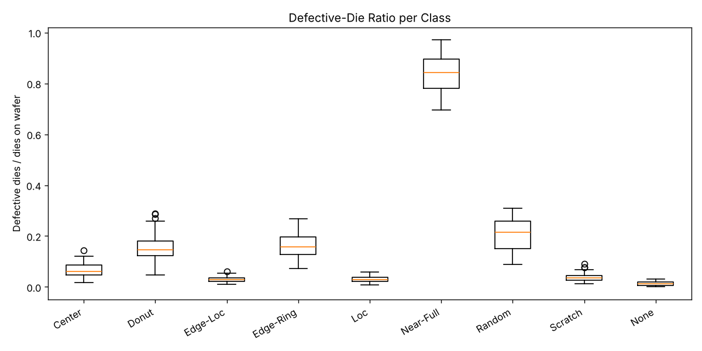

## 7. Data Preprocessing

1. Grayscale conversion and resizing to 64 × 64 (nearest-neighbour, so die values are not blended).
2. Normalisation to [0, 1] (divide by 255).
3. Label encoding with one fixed class → index mapping.
4. Stratified split, seed 42: **train 630, validation 135,
   test 135**, saved to `results/reports/data_split.csv` and reused by every model.
   No image appears in more than one split.
5. Augmentation on the **training set only**: random 90° rotations and horizontal flips. A wafer is
   circular, so these transformations never change the defect class.

For ResNet50 and EfficientNetB0 the 64 × 64 × 1 map is resized to 224 × 224 and replicated to three
channels *inside the model* (custom `WaferToRGB` layer), so all models share identical preprocessing.

## 8. Methodology

### 8.1 Custom CNN
`Input 64×64×1 → Conv2D(32) → MaxPool → Conv2D(64) → MaxPool → Conv2D(128) → MaxPool → Flatten →
Dense(128, ReLU) → Dropout(0.5) → Dense(9, Softmax)` — 1,142,537 parameters, trained from scratch.

### 8.2 ResNet50 (transfer learning)
ResNet50 backbone (50 layers with residual connections) → GlobalAveragePooling → Dense(128) →
Dropout(0.4) → Dense(9, Softmax). Weights: imagenet (frozen base).

### 8.3 EfficientNetB0 (transfer learning)
EfficientNetB0 backbone (compound-scaled MBConv blocks) → GlobalAveragePooling → Dense(128) →
Dropout(0.4) → Dense(9, Softmax). Weights: imagenet (frozen base).

When ImageNet weights can be downloaded the backbone is frozen and only the new head is trained; if the
download is not possible the code falls back to random initialisation with a trainable backbone and records
this (column *Weights* below).

## 9. Experimental Setup

| Item | Value |
|---|---|
| Language / framework | Python 3.13.16, TensorFlow 2.21.0 (Keras 3) |
| Hardware | CPU only (Linux-6.18.44-fc-v80-x86_64-with-glibc2.39) |
| Optimiser / loss | Adam, sparse categorical cross-entropy |
| Callbacks | EarlyStopping (patience 6, restore best), ReduceLROnPlateau (×0.5, patience 3), ModelCheckpoint |
| Seed | 42 |

| Model | Epochs completed | Best epoch | Val. accuracy (best epoch) | Best val. loss | Batch | LR | Weights |
|---|---|---|---|---|---|---|---|
| CNN | 30 / 30 | 28 | 0.9926 | 0.0342 | 32 | 0.001 | random init (trained from scratch) |
| ResNet50 | 20 / 20 | 20 | 0.9259 | 0.2261 | 32 | 0.001 | imagenet (frozen base) |
| EfficientNetB0 | 20 / 20 | 20 | 0.9630 | 0.1459 | 32 | 0.001 | imagenet (frozen base) |

## 10. Evaluation Metrics

*Accuracy* is the fraction of correct predictions. *Precision* is the fraction of predictions of a class
that are correct; *recall* the fraction of a class that is found; *F1* their harmonic mean. *Macro*
averages give every class equal weight. The *confusion matrix* shows which classes are confused.
*Training time* and *inference time per image* (median of 3 timed batch predictions after a warm-up)
measure cost.

## 11. Results

All metrics are on the held-out test set (135 images, never used for training or model selection
during training).

| Model | Accuracy | Macro Precision | Macro Recall | Macro F1 | Training time (s) | Inference (ms/image) | Parameters | Weights |
|---|---|---|---|---|---|---|---|---|
| CNN | 0.9704 | 0.9712 | 0.9704 | 0.9703 | 66.6 | 1.210 | 1,142,537 | random init (trained from scratch) |
| ResNet50 | 0.9333 | 0.9355 | 0.9333 | 0.9334 | 797.6 | 45.108 | 23,851,145 | imagenet (frozen base) |
| EfficientNetB0 | 0.9481 | 0.9558 | 0.9481 | 0.9481 | 354.1 | 19.228 | 4,214,700 | imagenet (frozen base) |

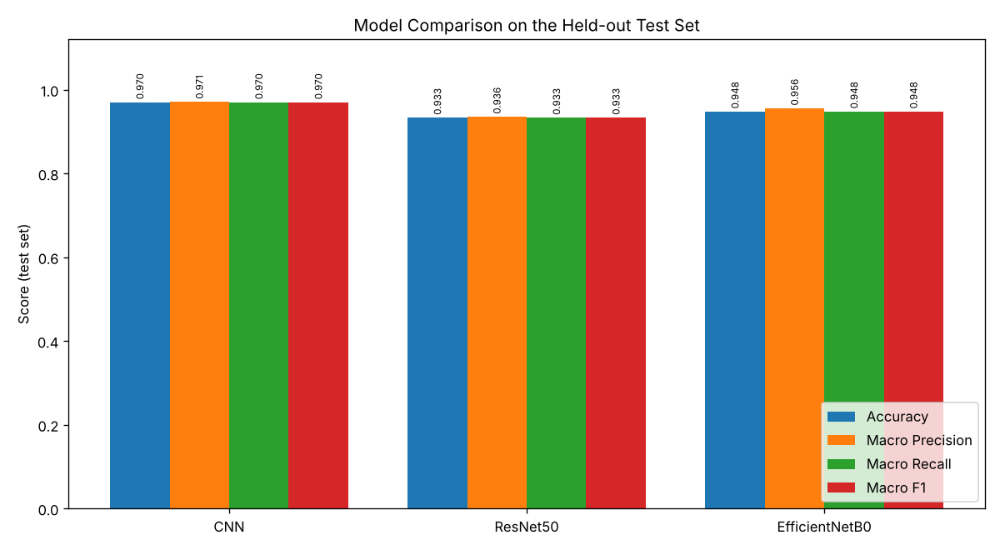

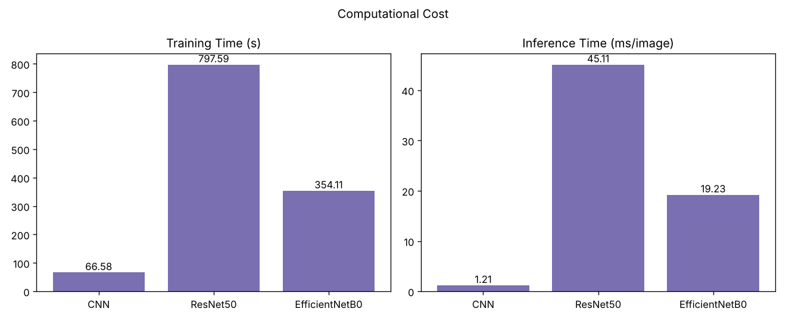

### Per-class F1-score

| Class | CNN F1 | ResNet50 F1 | EfficientNetB0 F1 |
|---|---|---|---|
| Center | 0.966 | 0.966 | 0.966 |
| Donut | 0.968 | 1.000 | 1.000 |
| Edge-Loc | 1.000 | 0.786 | 0.846 |
| Edge-Ring | 1.000 | 1.000 | 1.000 |
| Loc | 0.903 | 0.875 | 0.839 |
| Near-Full | 1.000 | 1.000 | 1.000 |
| Random | 1.000 | 1.000 | 1.000 |
| Scratch | 0.897 | 1.000 | 1.000 |
| None | 1.000 | 0.774 | 0.882 |

### Training curves

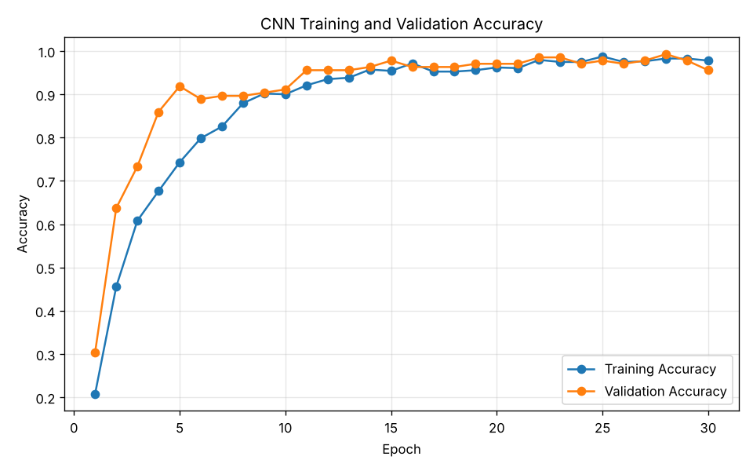
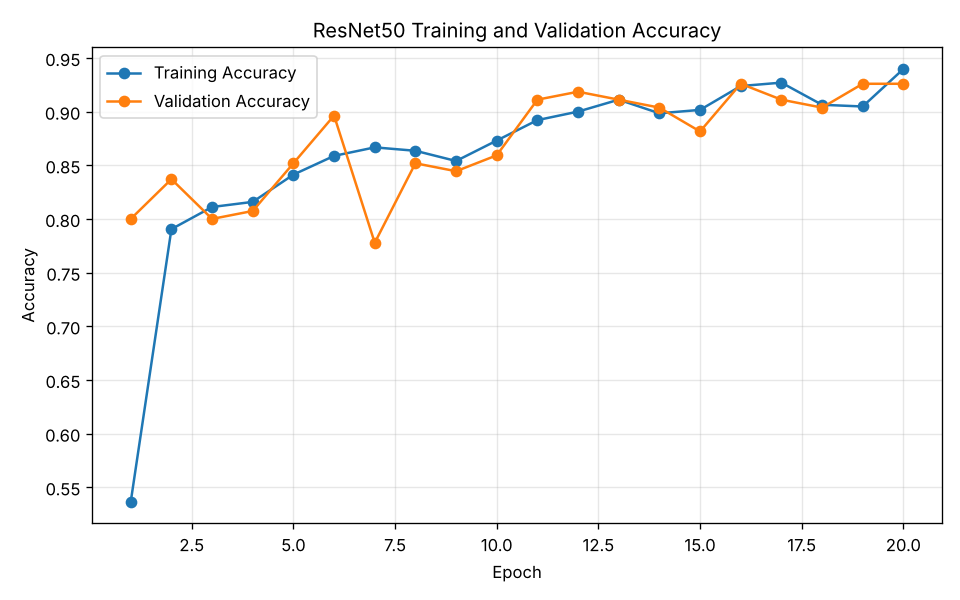
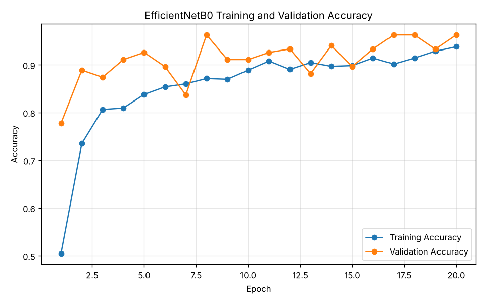

## 12. Confusion Matrix Analysis

**CNN** — 4 of 135 test images misclassified.
- 1 × Center predicted as Donut
- 1 × Loc predicted as Scratch
- 2 × Scratch predicted as Loc

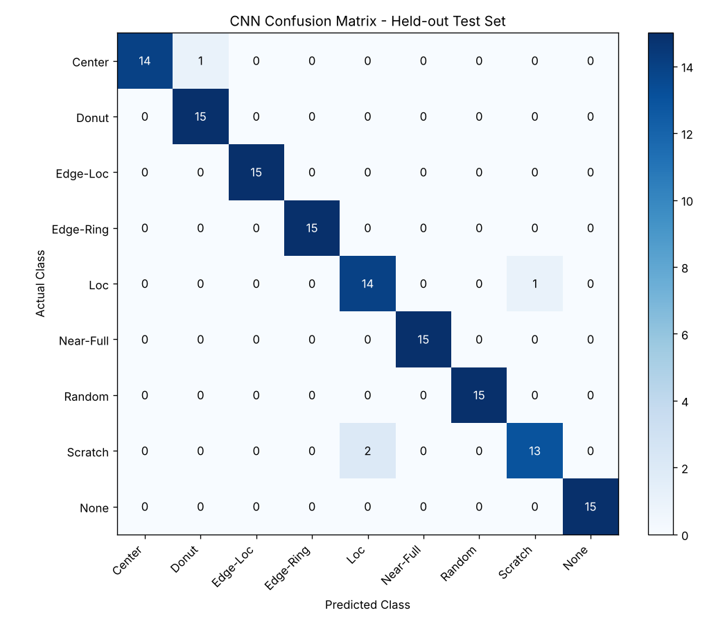

**ResNet50** — 9 of 135 test images misclassified.
- 1 × Center predicted as Loc
- 1 × Edge-Loc predicted as Loc
- 3 × Edge-Loc predicted as None
- 1 × Loc predicted as None
- 2 × None predicted as Edge-Loc
- 1 × None predicted as Loc

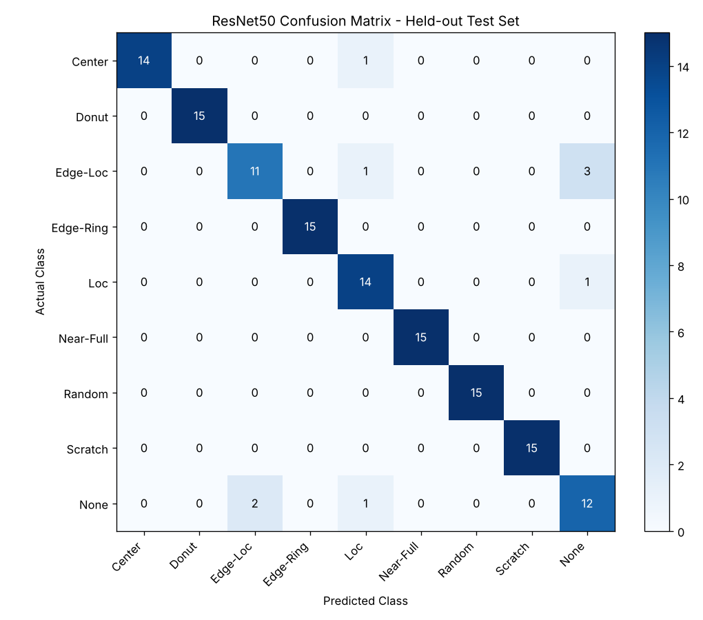

**EfficientNetB0** — 7 of 135 test images misclassified.
- 1 × Center predicted as Loc
- 2 × Edge-Loc predicted as Loc
- 2 × Edge-Loc predicted as None
- 2 × Loc predicted as None

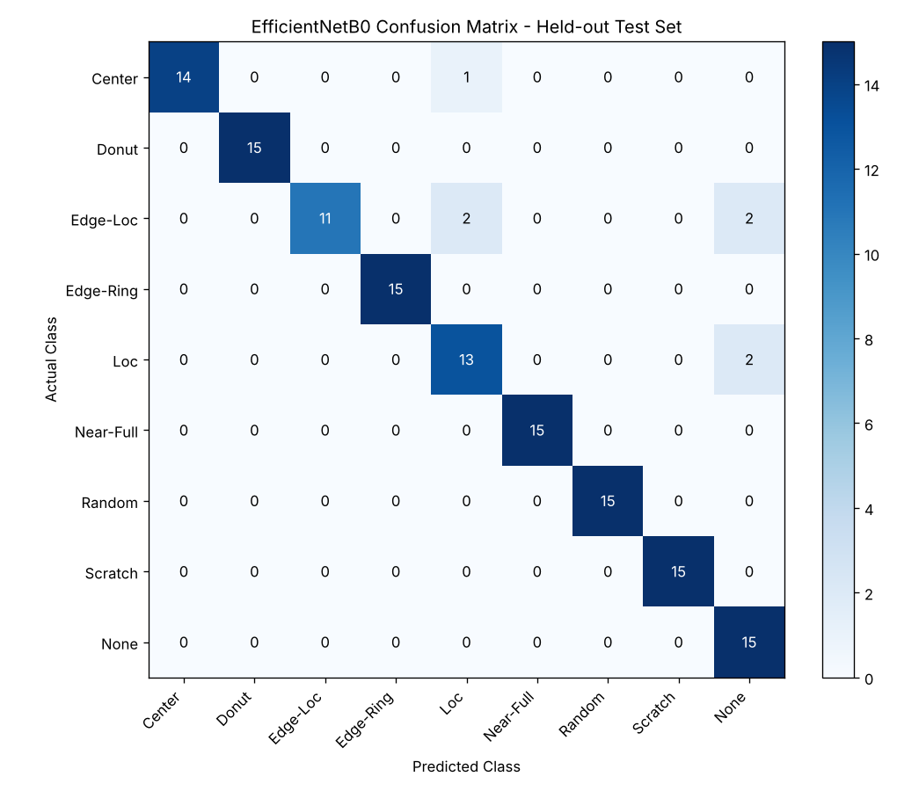

## 13. Model Comparison and Best Model Selection

Rule: highest macro F1; if within 0.005, higher accuracy, then faster inference.

**Selected model: CNN** (macro F1 0.9703, accuracy 0.9704).
CNN has the highest macro F1 (0.9703), ahead of the next model by 0.0223.

Fastest inference: CNN (1.210 ms/image).

## 14. Prediction Application

`src/predict.py` loads the model named in `results/reports/best_model.json`, applies the same
preprocessing as training and returns the predicted class, confidence, a confidence interpretation
(≥ 90 % very high, ≥ 70 % high, ≥ 50 % moderate, otherwise low) and the probabilities of all nine classes.
It validates that the file exists, has a supported format, can be opened and is at least 8 × 8 pixels.
`app/app.py` wraps it in a Gradio web interface (upload, preview, predict, probability chart, active
model, disclaimer). The model is loaded once at start-up; nothing is retrained.

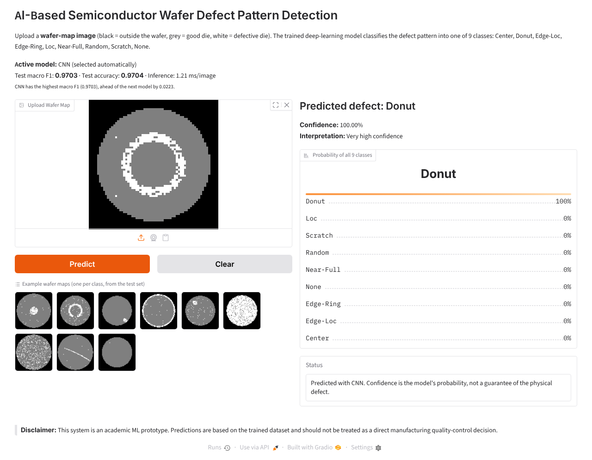

## 15. Discussion

- Ranking by macro F1: CNN (0.9703), EfficientNetB0 (0.9481), ResNet50 (0.9334). The best model reaches 0.9704 test accuracy.
- Almost all errors involve the classes defined by a *small* defect cluster — Loc, Edge-Loc and
  Scratch — confused with each other or with None (see Section 12). A short scratch looks like an
  elongated Loc cluster, and a tiny Loc/Edge-Loc cluster is hard to tell apart from the random background
  defects that every wafer (including None) contains. The pretrained models make more of the
  "small cluster → None" errors: their 64 → 224 pixel upscaling and ImageNet features are less sensitive to
  a handful of defective dies than a CNN that works on the native 64 × 64 grid.
- Large pretrained networks are not automatically better here: the maps are tiny, binary-like images,
  very different from ImageNet photographs, and a compact CNN trained from scratch can learn their spatial
  patterns directly at a fraction of the cost.
- Because the test set has only 135 images (15 per class), one misclassification changes accuracy by
  0.74 percentage points; small differences between models should not be over-interpreted.

## 16. Limitations

- The dataset is synthetic; real wafer maps (e.g. WM-811K) contain noisier, mixed and rarer patterns.
- 900 images and 15 test images per class give limited statistical power.
- Classes are balanced, unlike real production data where *None* dominates.
- Results come from a single training run (seed 42) on CPU.
- The system classifies wafer-map patterns; it does not inspect physical dies or camera images.
- The prototype has not been validated or deployed in a semiconductor fab.

## 17. Future Work

- Train and test on the real WM-811K dataset, with class-imbalance handling.
- Repeat training with several seeds and report mean ± standard deviation.
- Fine-tune the upper layers of the pretrained backbones.
- Grad-CAM heatmaps to show which wafer region drives each prediction.
- Detection of unseen patterns (low-confidence / anomaly detection) and mixed-defect classification.

## 18. Conclusion

The project delivers a working, reproducible wafer defect pattern classifier: validated synthetic data,
EDA, a leakage-free fixed split, three trained models compared on identical data, automatic best-model
selection (CNN), a prediction engine and a web application, plus an automated test suite.

## 19. References

1. Wu, M.-J., Jang, J.-S. R., Chen, J.-L. "Wafer Map Failure Pattern Recognition and Similarity Ranking
   for Large-Scale Data Sets." *IEEE Trans. Semiconductor Manufacturing*, 28(1), 2015 (WM-811K).
2. He, K., Zhang, X., Ren, S., Sun, J. "Deep Residual Learning for Image Recognition." CVPR, 2016.
3. Tan, M., Le, Q. "EfficientNet: Rethinking Model Scaling for Convolutional Neural Networks." ICML, 2019.
4. TensorFlow / Keras documentation — keras.io.
5. Pedregosa et al. "Scikit-learn: Machine Learning in Python." JMLR 12, 2011.
6. Gradio documentation — gradio.app.

## 20. Use of Generative AI

Generative AI (Claude) assisted with structuring the project, writing code, generating the synthetic
dataset generator and drafting this report. All experiments were executed and every reported metric was
produced by the project code and inserted automatically from the result files. The team reviewed the code
and results.
